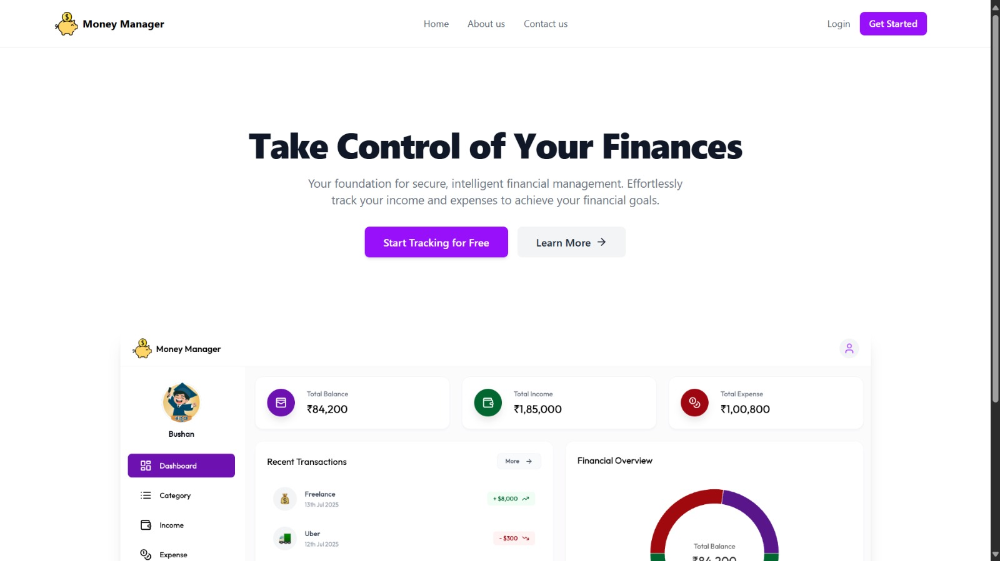
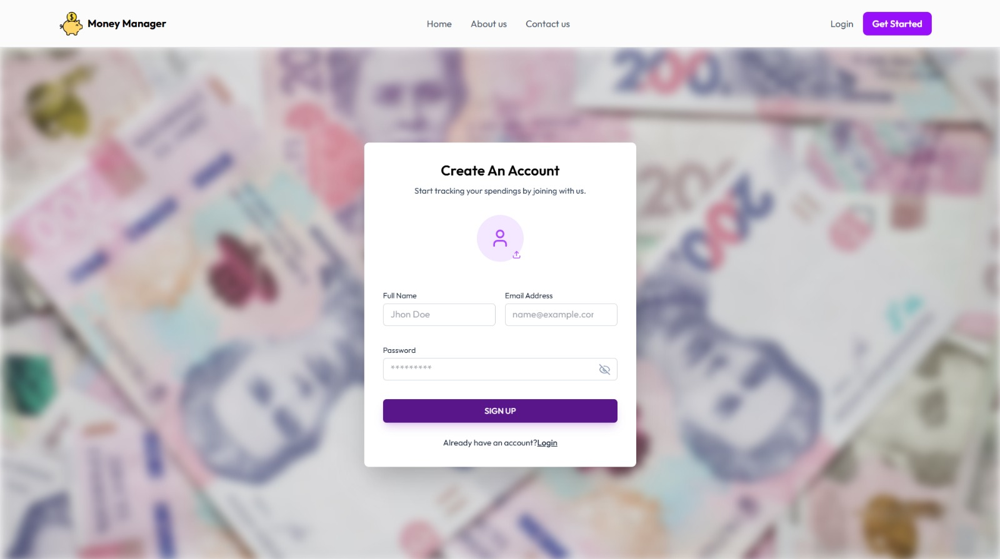
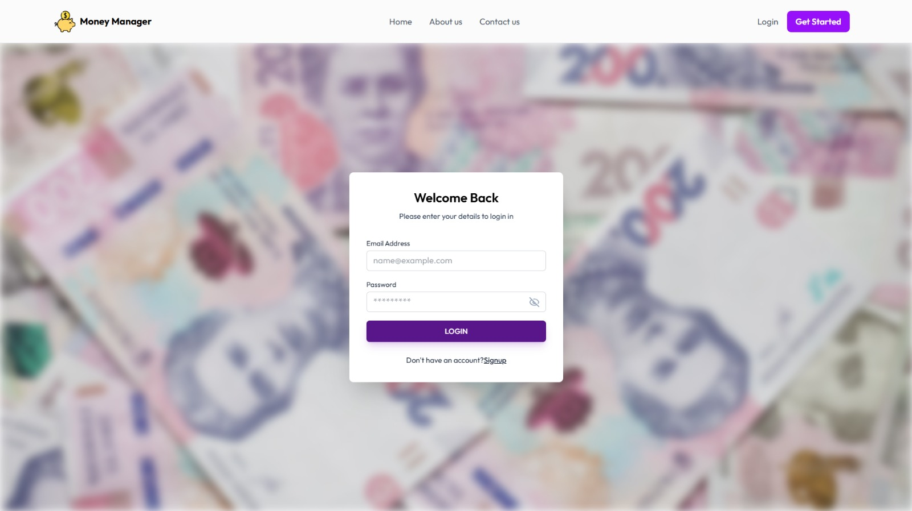

# 💰 Money Manager - Personal Finance Tracker

**Money Manager** is a full-stack web application designed to help users track their personal finances effortlessly. It provides a secure and intuitive dashboard to manage income, track expenses, visualize financial habits through charts, and filter transactions for detailed analysis.

Built with a robust **Java Spring Boot** backend and a responsive **React** frontend, this application is containerized with **Docker** and cloud-ready for **AWS**.

---

## 🚀 Tech Stack

### Backend
* **Language:** Java 21
* **Framework:** Spring Boot 3.5.3
* **Security:** Spring Security & JWT (JSON Web Tokens)
* **Database Interaction:** Spring Data JPA & Hibernate
* **Build Tool:** Maven
* **Email Service:** SMTP (Brevo)

### Frontend
* **Framework:** React.js (Vite)
* **Styling:** Tailwind CSS
* **Charts:** Recharts
* **HTTP Client:** Axios
* **State Management:** React Context API


## Screenshots

**Home page**



**SignUp Page**



**Login Page**




### Database & Storage
* **Database:** MySQL 8.0
* **Image Storage:** Cloudinary (Profile pictures)

### DevOps & Cloud
* **Containerization:** Docker
* **Cloud Provider:** AWS
    * **Compute:** EC2 (Backend hosting via Docker)
    * **Database:** RDS (Managed MySQL)
    * **Hosting:** AWS Amplify (Frontend)

---

## ✨ Features

* **User Authentication:** Secure Sign Up and Login with JWT and Email Activation.
* **Dashboard:** Real-time overview of Total Balance, Income, and Expenses.
* **Transaction Management:** Add, edit, and delete Income and Expense records.
* **Visual Reports:** Interactive Pie and Line charts to visualize spending habits.
* **Category Management:** Custom categories for better organization.
* **Advanced Filtering:** Filter transactions by date range, type, and category.
* **Export Data:** Download financial reports as Excel files.

---

## 🛠️ Getting Started (Local Setup)

Follow these instructions to get the project running on your local machine.

### Prerequisites
* **Java JDK 21** or higher
* **Node.js** (v18+) & **npm**
* **MySQL Server** running locally

### 1. Database Setup
1.  Open your MySQL client (Workbench or CLI).
2.  Create the database:
    ```sql
    CREATE DATABASE moneymanager;
    ```
    *(Note: Tables will be auto-generated by Hibernate).*

### 2. Backend Setup
1.  Navigate to the backend folder:
    ```bash
    cd moneymanager
    ```
2.  Open `src/main/resources/application.properties` and configure your credentials:
    ```properties
    # Database Configuration
    spring.datasource.username=YOUR_MYSQL_USERNAME (e.g., root)
    spring.datasource.password=YOUR_MYSQL_PASSWORD

    # Email Configuration (Brevo/SMTP)
    spring.mail.username=YOUR_BREVO_LOGIN
    spring.mail.password=YOUR_BREVO_MASTER_PASSWORD
    spring.mail.properties.mail.smtp.from=YOUR_VERIFIED_SENDER_EMAIL
    
    # App URLs
    money.manager.frontend.url=http://localhost:5173
    app.activation.url=http://localhost:8080
    ```
3.  Run the application:
    ```bash
    mvn spring-boot:run
    ```
    *The backend will start on `http://localhost:8080`.*

### 3. Frontend Setup
1.  Open a new terminal and navigate to the frontend folder:
    ```bash
    cd moneymanagerwebapp
    ```
2.  Install dependencies:
    ```bash
    npm install
    ```
3.  Configure the API Endpoint in `src/util/apiEndpoints.js`:
    ```javascript
    export const BASE_URL = "http://localhost:8080/api/v1.0";
    ```
4.  Run the development server:
    ```bash
    npm run dev
    ```
    *The frontend will start on `http://localhost:5173`.*

---

## ☁️ Deployment Guide

This project is configured for a standard 3-tier cloud architecture on AWS.

### 1. Database (AWS RDS)
* Create a **MySQL** instance on AWS RDS.
* Ensure the Security Group allows traffic on port `3306` from your EC2 instance.
* **Crucial:** Connect via Workbench and run `CREATE DATABASE moneymanager;`.

### 2. Backend (AWS EC2 + Docker)
* Build the Docker image and push to Docker Hub:
    ```bash
    mvn clean package -DskipTests
    docker build -t youruser/moneymanager-backend .
    docker push youruser/moneymanager-backend
    ```
* SSH into your EC2 instance and run the container:
    ```bash
    sudo docker run -d -p 80:8080 \
      -e SPRING_DATASOURCE_URL=jdbc:mysql://YOUR_RDS_ENDPOINT:3306/moneymanager \
      -e SPRING_DATASOURCE_USERNAME=root \
      -e SPRING_DATASOURCE_PASSWORD=YOUR_RDS_PASSWORD \
      -e BREVO_USERNAME=... \
      -e BREVO_PASSWORD=... \
      youruser/moneymanager-backend
    ```

### 3. Frontend (AWS Amplify)
* Push the `moneymanagerwebapp` code to GitHub.
* Connect the repo to **AWS Amplify**.
* Add an Environment Variable in Amplify settings:
    * `VITE_API_BASE_URL`: `http://YOUR_EC2_PUBLIC_IP/api/v1.0`

---

## 🔧 Troubleshooting & Quick Fixes

### 1. "Network Error" on Sign Up / Login (Mixed Content)
**Issue:** If your frontend is hosted on HTTPS (e.g., Amplify) but your backend is on HTTP (EC2), browsers block the request for security.
**Quick Fix (Client-side):**
1.  Click the "Not Secure" or Lock icon in your browser address bar.
2.  Go to **Site Settings**.
3.  Find **Insecure Content** and set it to **Allow**.
4.  Reload the page.

### 2. "Unknown database 'moneymanager'"
**Issue:** The backend crashes immediately because the specific database schema doesn't exist in MySQL/RDS.
**Fix:** Connect to your database tool and run:
```sql
CREATE DATABASE moneymanager;
